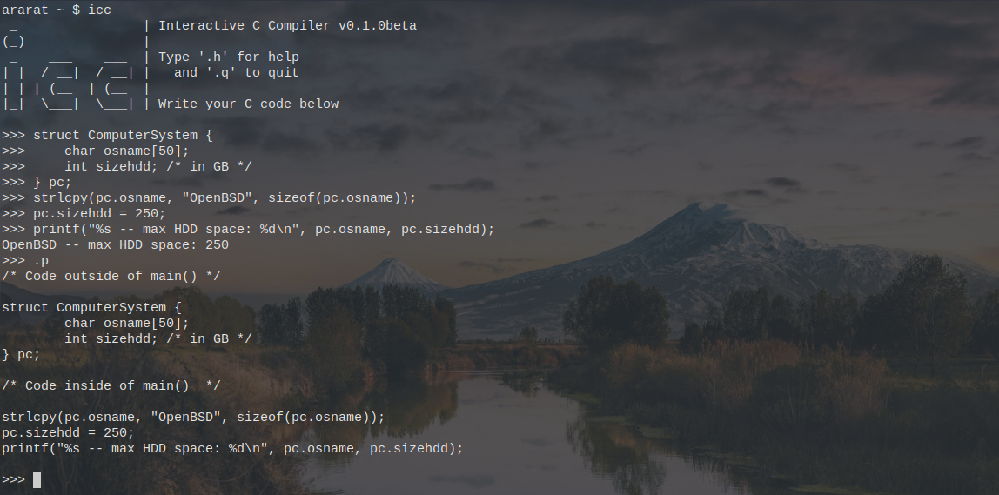

# icc

Interactive C Compiler

`icc` is a C REPL inspired by [Interactive GCC](https://github.com/alexandru-dinu/igcc/)
by Alexandru Dinu, which is a fork of [Interactive GCC](https://sourceforge.net/projects/igcc/)
by Andy Balaam.

The main difference is `icc` is coded in C (not Python), will only support the
C language, and is tightly integrated with Unix environments.

Please note, this is a work in progress. Contributions are welcomed.

## Install

To install `icc`, run `make && make install`.

## License

Proudly free software, this code is licensed under the terms of the Mozilla Public License, v.2.0.
